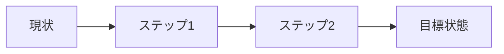

<!--
スライドテンプレート
使用方法:
1. このファイルをコピーして日付を入れたファイル名に変更
2. 各セクションの内容を記入
3. 必要に応じてスライドを追加・削除
-->

# プレゼンテーションタイトル

サブタイトルまたは説明

Masato Naka (X: @gymnstcs, GitHub: nakamasato)
YYYY年MM月DD日

---

## アジェンダ

1. 導入・背景
2. 問題提起
3. 解決策の提案
4. 実装・詳細
5. 結果・効果
6. まとめ・今後の展望

---

## 導入・背景

### 現状の説明
- ポイント1
- ポイント2
- ポイント3

### なぜこのトピックが重要か
重要性を説明するテキスト

---

## 問題提起

### 現在の課題

| 課題 | 影響 | 優先度 |
|------|------|--------|
| 課題1 | 影響の説明 | 高 |
| 課題2 | 影響の説明 | 中 |
| 課題3 | 影響の説明 | 低 |

---

## 解決策の提案

### アプローチ



### 期待される効果
- 効果1: 説明
- 効果2: 説明
- 効果3: 説明

---

## 実装・詳細

### 技術スタック
- 技術1
- 技術2
- 技術3

### アーキテクチャ
```
┌─────────────┐     ┌─────────────┐
│   Component │────▶│   Component │
│      A      │     │      B      │
└─────────────┘     └─────────────┘
```

---

## コード例

```javascript
// 実装のサンプルコード
function exampleFunction(param) {
  // 処理の説明
  return result;
}
```

### ポイント
- 実装のポイント1
- 実装のポイント2

---

## デモンストレーション

### デモの概要
- デモで見せること1
- デモで見せること2

### 注目ポイント
重要な機能や改善点

---

## 結果・効果

### 定量的な結果

| 指標 | 改善前 | 改善後 | 改善率 |
|------|--------|--------|--------|
| 指標1 | 100 | 150 | +50% |
| 指標2 | 50 | 30 | -40% |

### 定性的な効果
- ユーザー体験の向上
- 開発効率の改善

---

## まとめ

### 主要なポイント
1. **ポイント1**: 説明
2. **ポイント2**: 説明
3. **ポイント3**: 説明

### 学んだこと
- 学び1
- 学び2

---

## 今後の展望

### 短期的な計画 (1-3ヶ月)
- タスク1
- タスク2

### 長期的なビジョン (6-12ヶ月)
- 目標1
- 目標2

---

## 質疑応答

### ご質問はありますか？

連絡先:
- Email: your.email@example.com
- Slack: @yourname

---

## 参考資料

### ドキュメント
- [リンク1](https://example.com)
- [リンク2](https://example.com)

### 関連プロジェクト
- プロジェクト1
- プロジェクト2

---

# ありがとうございました

プレゼンテーションの終了メッセージ
