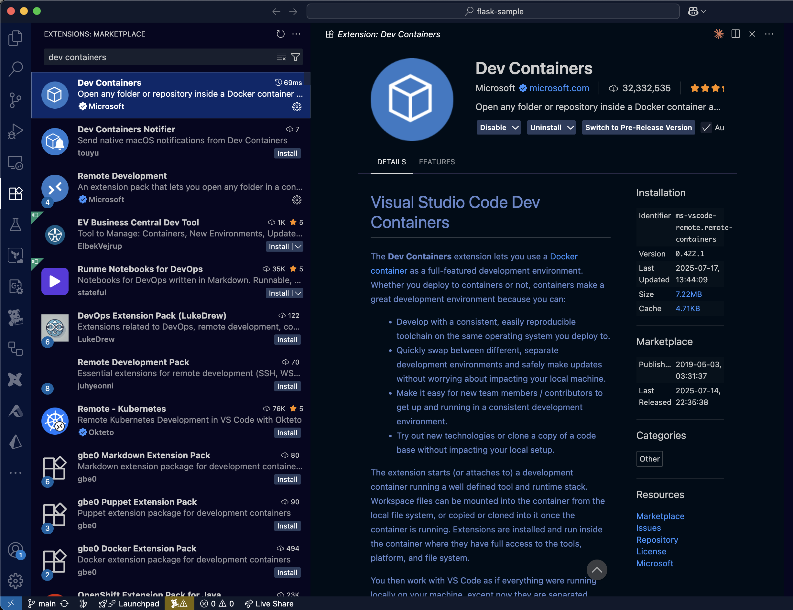

<!-- _class: title -->

# Dev Containerで安全に<br>Claude Codeを使う

技術的な開発環境の<br>セキュリティ強化

naka (X: @gymnstcs, GitHub: nakamasato)
2025年7月27日

---

## アジェンダ

1. 背景と課題
2. Dev Containerの導入方法
3. 初めて使うときに引っかかるポイント
4. デモ

---

## 背景：深刻な事故事例

### Cursor YOLOモードのリスク

***"Cursor YOLO deleted everything in my computer!"***

[Reddit投稿](https://www.reddit.com/r/theprimeagen/comments/1lbv5kg/cursor_yolo_deleted_everything_in_my_computer/)

### 潜在リスク
- AIがホストファイル全体にアクセス
- 予期しない削除や変更
- **完全なデータ損失**

---

## Dev Containerが必要な理由

### Vibe Coding普及の課題
- `--dangerously-skip-permissions`による予期せぬセキュリティリスク
- ホスト全体への無制限アクセス
- セキュリティ vs 開発効率のジレンマ

### Dev Containerによる解決
- **コンテナによる隔離された開発環境**
- IDEとの連携により今までと同じ開発体験を提供
- チーム開発でも使える共通の設定

---

## Dev Containerとは

### VS Code開発コンテナ


- **Docker上の開発環境**
- プロジェクト固有の設定
- 環境の完全な再現性

参考：[VS Code公式ドキュメント](https://code.visualstudio.com/docs/devcontainers/containers)

---

## 導入の流れ

### 1. 拡張機能をインストール



- VS Code拡張機能から「Dev Containers」を検索・追加

### 2. 設定ファイルを作成
- `.devcontainer/devcontainer.json`を追加

### 3. コンテナで開く
- コマンドパレット → `Reopen in Container`

---

## 導入方法：基本設定

### `.devcontainer/devcontainer.json`
```json
{
  "name": "Python Devcontainer",
  "image": "mcr.microsoft.com/devcontainers/python:3.12",
  "features": {
    "ghcr.io/devcontainers/features/github-cli:1": {},
    "ghcr.io/anthropics/devcontainer-features/claude-code:1.0": {}
  },
  "remoteUser": "vscode"
}
```

---

## コンテナ設定パターン1：既存イメージ

### 最も簡単な方法
```json
{
  "name": "Python Development",
  "image": "mcr.microsoft.com/devcontainers/python:3.12"
}
```

### メリット
- **設定が簡単**
- すぐに使い始められる
- Microsoft提供の安定したイメージ

---

## コンテナ設定パターン2：カスタムDockerfile

### 細かくカスタマイズしたい場合
```json
{
  "name": "Custom Environment",
  "build": {
    "dockerfile": "Dockerfile",
    "context": "."
  }
}
```

```dockerfile
FROM mcr.microsoft.com/devcontainers/base
RUN apt-get update && apt-get install -y \
    python3 nodejs npm
```

- 必要なCLIをインストール
- ディレクトリの作成・権限付与 etc.

---

## コンテナ設定パターン3：Docker Compose

### 複数コンテナ（DB等）が必要な場合
```json
{
  "name": "Full Stack App",
  "dockerComposeFile": "docker-compose.yml",
  "service": "app",
  "workspaceFolder": "/workspace"
}
```

### 用途
- **データベース連携**
- **マイクロサービス開発**

---

## 必要CLIツールの設定

### 基本セット
- **git**: バージョン管理
- **gh**: GitHub CLI
- **claude**: Claude Code
- **tig, jq**: 便利ツール

### 設定方法
- **Features**で一括指定
- **Dockerfile**でカスタム

---

## Featuresを使った拡張

### Claudeを含む各種ツールの追加
```json
{
  "features": {
    "ghcr.io/anthropics/devcontainer-features/claude-code:1.0": {},
    "ghcr.io/devcontainers/features/github-cli:1": {},
    "ghcr.io/devcontainers/features/git:1": {}
  }
}
```

### その他便利なFeatures
- **pre-commit**: コード品質チェック
- **docker-in-docker**: Docker操作

---

## 引っかかりポイント1：gh command認証

### 問題
- 毎回手動ログインが面倒

### 解決策：GH_TOKEN環境変数の設定
```json
{
  "runArgs": ["--env-file", ".devcontainer/.env.devcontainer"],
  "initializeCommand": "echo \"GH_TOKEN=$(gh auth token)\" > .devcontainer/.env.devcontainer"
}
```

```bash
# .gitignoreに追加
.devcontainer/.env.devcontainer
```

---

## 引っかかりポイント2：Claude Code設定

### 問題
- Claude Codeの設定が毎回消える
- ユーザー認証が毎回必須になる

### 解決策：設定ディレクトリの永続化 + CLAUDE_CONFIG_DIRの設定
```json
{
  "containerEnv": {
    "CLAUDE_CONFIG_DIR": "/home/vscode/.claude"
  },
  "mounts": [
    "source=claude-config,target=/home/vscode/.config/claude,type=volume"
  ]
}
```

※ `/home/vscode/` 部分はcontainerUserによって書き換え

---

## 引っかかりポイント3：root権限エラー

### 問題
- `--dangerously-skip-permissions cannot be used with root/sudo privileges for security reasons`

### 解決策：非rootユーザー
```json
{
  "remoteUser": "vscode",
  "containerUser": "vscode"
}
```

※ `--dangerously-skip-permissions`は非rootユーザーが必要

---

## まとめ

### セキュリティ向上
- ホストから完全隔離
- プロジェクト境界明確化
- YOLOモードもリスクを抑えて利用可

### 開発効率向上
- チーム共通環境
- 一度設定すれば使い回し可能

---

## ベストプラクティス

### 段階的導入
1. 基本イメージから開始
2. 必要ツールを段階追加
3. チーム全体で設定共有

### セキュリティ強化
- **Claude CodeのDenyルール整備**
- **ネットワークの制限**
- 参考：[Anthropic公式例](https://github.com/anthropics/claude-code/tree/main/.devcontainer)

---

## デモ

### デモ内容
- Dev Container設定作成
- VS Codeでコンテナ起動
- Claude Code安全実行
- ファイルアクセス制限確認

---

<!-- _class: title -->

# ご清聴ありがとうございました

Dev Containerでよりセキュアな<br>爆速開発環境をつくりましょう!

参考：[Qiita記事](https://qiita.com/nakamasato/items/77b1567914fe51d08525)
